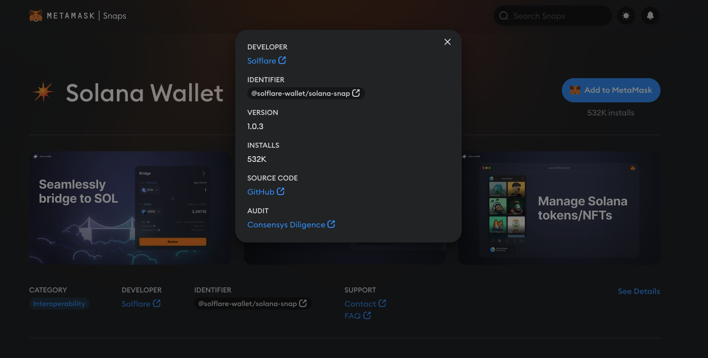
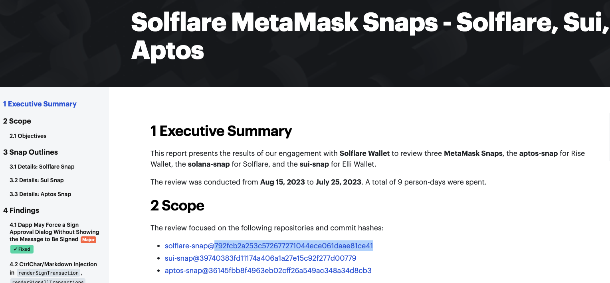

# Snap Audit Validator

## Usage

```bash
Usage: validate-snap.sh <package name> <audited git commit or tag>                          for the latest NPM version
       validate-snap.sh <package name> <audited git commit or tag> <package version>        for a specific NPM version
```

## Example: Solana Snap

#### 1. Go to the official page for [@solflare-wallet/solana-snap](https://snaps.metamask.io/snap/npm/solflare-wallet/solana-snap/)


#### 2. Retrieve [the audit report](https://consensys.io/diligence/audits/2023/08/solflare-metamask-snaps-solflare-sui-aptos/)


#### 3. Find the audited commit hash (or git tag)
In this case `792fcb2`


#### 4. Run the validator against the latest version
```bash
 $ ./validate-snap.sh @solflare-wallet/solana-snap 792fcb2
   Fetching snap manifest for package @solflare-wallet/solana-snap@latest
   Validating published snap manifest
✅ Published shasum matches: hyw8D7jdrDe4FGohp7hjn7miXCk5JVo7yohV5Q3I2io=
   Validating Git URL
✅ Repository URL matches: https://github.com/solflare-wallet/solflare-snap.git
   Validating audited snap manifest
❌ Audited shasum mismatch: KQbUJpORj9R5GsSLwxPvZknSK/eQXIqUcQGpRr6HSEU= != hyw8D7jdrDe4FGohp7hjn7miXCk5JVo7yohV5Q3I2io=

```
**It fails!** 
The latest version is not the audited one, so let's try with earlier versions.

#### 5. Find earlier versions [from NPM](https://www.npmjs.com/package/@solflare-wallet/solana-snap?activeTab=versions).


#### 6. Let's try again with `1.0.0`
```bash
 $ ./validate-snap.sh @solflare-wallet/solana-snap 792fcb2 1.0.0
   Fetching snap manifest for package @solflare-wallet/solana-snap@1.0.0
   Validating published snap manifest
✅ Published shasum matches: KQbUJpORj9R5GsSLwxPvZknSK/eQXIqUcQGpRr6HSEU=
   Validating Git URL
💣 Repository URL absent from snap.manifest.json
   Validating audited snap manifest
✅ Audited shasum matches: KQbUJpORj9R5GsSLwxPvZknSK/eQXIqUcQGpRr6HSEU=
   Cleaning up
```
**It works!** 
We have confirmed that the last audited Snap version is `1.0.0`.

